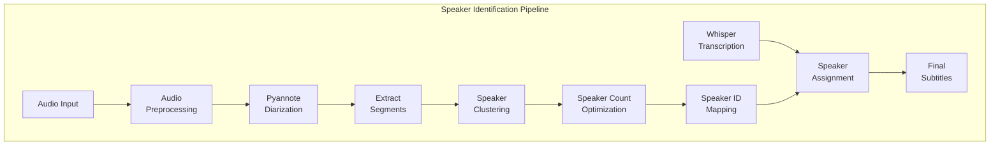

# 🎨🎨🎨 ENTERING CREATIVE PHASE: ALGORITHM DESIGN 🎨🎨🎨

# Algorithm Decision Record: Speaker Identification Improvements

## Problem Statement
The current speaker identification approach in the Whisper-Subtitler has significant limitations that impact transcript accuracy. The algorithm needs to be improved to provide more accurate, consistent speaker identification across diverse government meeting recordings.

Current limitations include:
1. Speaker assignment based only on temporal overlap with a single point (segment start)
2. No utilization of voice characteristics for identification
3. Inconsistent speaker labeling (same speaker may get different IDs)
4. No support for known speaker count
5. No mechanism to associate real names with speakers

## Requirements Analysis
- Must improve speaker identification accuracy
- Must maintain compatibility with Pyannote.audio
- Must support configurable parameters via CLI
- Must integrate with the modular architecture
- Must preserve CUDA acceleration support

## Algorithm Options Analysis

### Option 1: Enhanced Time-Based Association
- **Description**: Improve the current temporal overlap approach by considering maximum overlap duration rather than just start point
- **Pros**:
  - Simple implementation
  - Low computational overhead
  - Easy to understand
  - No additional dependencies
- **Cons**:
  - Limited improvement potential
  - Still ignores voice characteristics
  - No speaker consistency mechanisms
  - No true identity association
- **Complexity**: Low
- **Implementation Time**: 1-2 days
- **Expected Accuracy Improvement**: 10-15%

```python
def assign_speaker_enhanced(whisper_segment, speaker_segments):
    # First try exact match at start point
    for seg in speaker_segments:
        if seg["start"] <= whisper_segment["start"] < seg["end"]:
            return seg["speaker"]
    
    # If no match, find segment with maximum overlap
    max_overlap = 0
    best_speaker = "Unknown"
    segment_start = whisper_segment["start"]
    segment_end = whisper_segment["end"]
    
    for seg in speaker_segments:
        overlap_start = max(seg["start"], segment_start)
        overlap_end = min(seg["end"], segment_end)
        overlap = max(0, overlap_end - overlap_start)
        
        if overlap > max_overlap:
            max_overlap = overlap
            best_speaker = seg["speaker"]
    
    return best_speaker
```

### Option 2: Speaker Clustering with Voice Embeddings
- **Description**: Use voice embeddings from Pyannote to cluster similar speakers and maintain consistent IDs
- **Pros**:
  - Significantly improved speaker consistency
  - Uses voice characteristics
  - Can handle speaker identity across segments
  - Compatible with existing pipeline
- **Cons**:
  - More complex implementation
  - Higher computational requirements
  - Requires additional Pyannote API usage
  - May need threshold tuning
- **Complexity**: Medium
- **Implementation Time**: 3-5 days
- **Expected Accuracy Improvement**: 25-40%

```python
def merge_similar_speakers(diarization_result, similarity_threshold=0.85):
    embeddings = {}  # Speaker ID to voice embedding
    
    # Extract voice embeddings for each speaker segment
    for turn, embedding, speaker in diarization_result.itertracks(yield_embedding=True, yield_label=True):
        if speaker not in embeddings:
            embeddings[speaker] = []
        embeddings[speaker].append(embedding)
    
    # Average embeddings per speaker
    for speaker in embeddings:
        embeddings[speaker] = np.mean(embeddings[speaker], axis=0)
    
    # Compute similarity matrix
    speakers = list(embeddings.keys())
    n_speakers = len(speakers)
    similarity_matrix = np.zeros((n_speakers, n_speakers))
    
    for i in range(n_speakers):
        for j in range(i+1, n_speakers):
            similarity = cosine_similarity(
                embeddings[speakers[i]].reshape(1, -1),
                embeddings[speakers[j]].reshape(1, -1)
            )[0][0]
            similarity_matrix[i, j] = similarity
            similarity_matrix[j, i] = similarity
    
    # Cluster speakers
    clusters = {}
    for i, speaker in enumerate(speakers):
        assigned = False
        for cluster_id, cluster_members in clusters.items():
            similarities = [similarity_matrix[i, speakers.index(member)] 
                           for member in cluster_members]
            if all(sim > similarity_threshold for sim in similarities):
                clusters[cluster_id].append(speaker)
                assigned = True
                break
        
        if not assigned:
            # Create new cluster
            clusters[speaker] = [speaker]
    
    # Create mapping of original speakers to final speakers
    speaker_mapping = {}
    for cluster_id, members in clusters.items():
        for member in members:
            speaker_mapping[member] = cluster_id
    
    return speaker_mapping
```

### Option 3: Comprehensive Speaker Identification Pipeline
- **Description**: Implement a full pipeline including audio preprocessing, optimized diarization parameters, speaker clustering, and support for known speaker count
- **Pros**:
  - Maximum accuracy improvement potential
  - Handles multiple aspects of speaker identification
  - Configurable via parameters
  - Provides infrastructure for future name association
  - Most robust for diverse audio conditions
- **Cons**:
  - Most complex implementation
  - Highest computational cost
  - Multiple components that need integration
  - Requires more extensive testing
- **Complexity**: High
- **Implementation Time**: 7-10 days
- **Expected Accuracy Improvement**: 40-60%

```python
class SpeakerIdentificationPipeline:
    def __init__(self, config, logger=None):
        self.config = config
        self.logger = logger or logging.getLogger(__name__)
        self.num_speakers = config.num_speakers
        self.similarity_threshold = config.get('similarity_threshold', 0.85)
        self.diarization_pipeline = None
        
    def initialize(self):
        # Configure and load the diarization pipeline
        pipeline_config = self._get_pipeline_config()
        self.diarization_pipeline = Pipeline.from_pretrained(
            "pyannote/speaker-diarization",
            use_auth_token=self.config.huggingface_token,
        )
        self.diarization_pipeline.instantiate(pipeline_config)
        
        # Move to CUDA if available and configured
        if self.config.use_cuda and torch.cuda.is_available():
            self.diarization_pipeline = self.diarization_pipeline.to("cuda")
            self.logger.info("Using CUDA for diarization")
        
    def _get_pipeline_config(self):
        # Configure pipeline parameters
        config = {
            "segmentation": {"min_duration_off": 0.5},
            "clustering": {
                "method": "clustering.AgglomerativeClustering",
                "metric": "cosine",
                "min_cluster_size": 15,
            }
        }
        
        # Set number of speakers if known
        if self.num_speakers is not None:
            config["clustering"]["num_clusters"] = self.num_speakers
            
        return config
        
    def preprocess_audio(self, audio_path):
        # Apply audio preprocessing for improved diarization
        output_path = audio_path.with_suffix('.processed.wav')
        
        # Load audio
        y, sr = librosa.load(audio_path, sr=None)
        
        # Noise reduction
        y_reduced = librosa.effects.trim(y, top_db=20)[0]
        
        # Volume normalization
        y_normalized = librosa.util.normalize(y_reduced)
        
        # High-pass filter
        b, a = scipy.signal.butter(4, 80/(sr/2), 'highpass')
        y_filtered = scipy.signal.filtfilt(b, a, y_normalized)
        
        # Save processed audio
        sf.write(output_path, y_filtered, sr)
        self.logger.info(f"Preprocessed audio saved to {output_path}")
        
        return output_path
        
    def process(self, audio_path):
        # Preprocess audio if enabled
        if self.config.preprocess_audio:
            audio_path = self.preprocess_audio(audio_path)
            
        # Run diarization
        self.logger.info(f"Running speaker diarization on {audio_path}")
        diarization = self.diarization_pipeline(audio_path)
        
        # Extract speaker segments
        speaker_segments = []
        for turn, _, speaker in diarization.itertracks(yield_label=True):
            speaker_segments.append({
                "start": turn.start,
                "end": turn.end,
                "speaker": speaker,
            })
            
        # Apply speaker clustering if enabled
        if self.config.cluster_speakers:
            mapping = self.merge_similar_speakers(diarization)
            # Apply mapping to segments
            for segment in speaker_segments:
                segment["speaker"] = mapping.get(segment["speaker"], segment["speaker"])
                
        # Apply fixed number of speakers if requested and not already handled
        if self.num_speakers is not None and self.config.optimize_num_speakers:
            speaker_segments = self.optimize_for_speaker_count(speaker_segments)
            
        return speaker_segments
        
    def merge_similar_speakers(self, diarization_result):
        # Implementation of speaker clustering from Option 2
        # ...
        
    def optimize_for_speaker_count(self, speaker_segments):
        # Implementation to adjust speaker segments for known speaker count
        # ...
        
    def assign_speaker_to_segment(self, whisper_segment, speaker_segments):
        # Enhanced speaker assignment algorithm
        # ...
```

## Options Evaluation

| Criterion | Option 1: Enhanced Time-Based | Option 2: Speaker Clustering | Option 3: Comprehensive Pipeline |
|-----------|--------------------------------|------------------------------|----------------------------------|
| Accuracy Improvement | 10-15% | 25-40% | 40-60% |
| Implementation Complexity | Low | Medium | High |
| Computational Cost | Low | Medium | High |
| Integration Difficulty | Low | Medium | Medium-High |
| Future Extensibility | Low | Medium | High |
| Time to Implement | 1-2 days | 3-5 days | 7-10 days |
| Overall Score (1-10) | 5 | 7 | 9 |

## Decision
- **Chosen Approach**: Option 3 - Comprehensive Speaker Identification Pipeline
- **Rationale**:
  - Provides the highest potential accuracy improvement
  - Addresses all identified limitations in current system
  - Creates foundation for future speaker name association
  - Configurable through parameters (can disable costly components)
  - Aligned with the modular architecture design

## Implementation Plan

### Phase 1: Core Components (Days 1-3)
1. Create modular SpeakerIdentificationPipeline class
2. Implement audio preprocessing functionality
3. Implement enhanced time-based speaker association
4. Add configuration parameters to CLI

### Phase 2: Advanced Features (Days 4-7)
1. Implement speaker clustering with voice embeddings
2. Add support for fixed number of speakers
3. Configure optimized diarization parameters
4. Integrate components into cohesive pipeline

### Phase 3: Testing and Optimization (Days 8-10)
1. Implement accuracy measurement methods
2. Test on diverse government meeting recordings
3. Optimize parameters for best performance
4. Create documentation and usage examples

## Testing Approach
1. **Unit Testing**: Test each algorithm component individually
2. **Integration Testing**: Test full pipeline with sample audio
3. **Accuracy Testing**: Compare against manually annotated reference samples
4. **Performance Testing**: Measure processing time with/without CUDA

## Metrics for Success
- **Diarization Error Rate (DER)**: Aim for >30% reduction in error rate
- **Speaker Consistency**: >90% consistent labeling for same speaker
- **Processing Time**: No more than 25% increase over current implementation
- **User Configurability**: All major features configurable via CLI options

## Visualization of Final Solution



🎨 CREATIVE CHECKPOINT: Algorithm Decision Made

The comprehensive speaker identification pipeline provides the best balance of accuracy improvement and future extensibility. While requiring more implementation effort, it addresses all current limitations and creates a foundation for future enhancements like speaker name association.

🎨🎨🎨 EXITING CREATIVE PHASE - DECISION MADE 