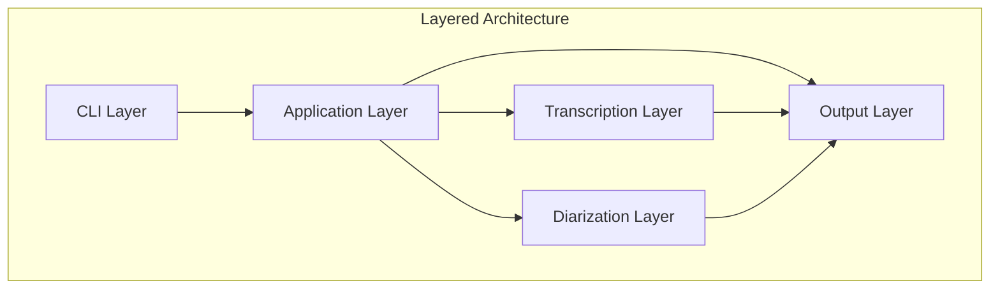
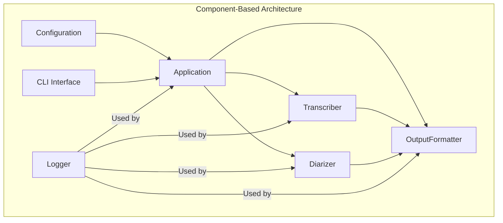
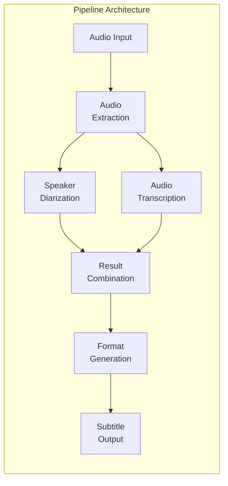
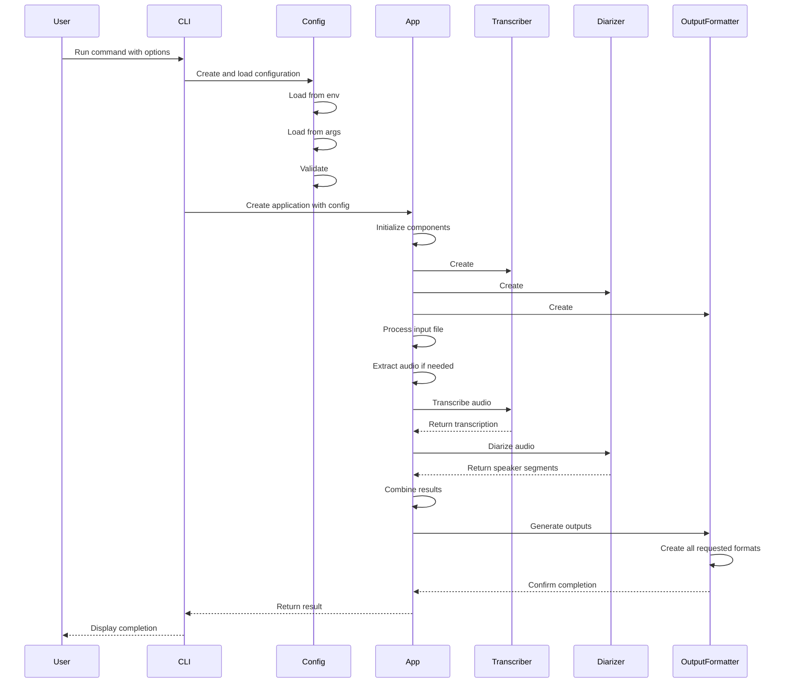

# 🎨🎨🎨 ENTERING CREATIVE PHASE: ARCHITECTURE DESIGN 🎨🎨🎨

# Architecture Decision Record: Modular Whisper-Subtitler

## Context
- **System Requirements**:
  - Refactor monolithic script into modular architecture
  - Support multiple output formats (TXT, SRT, VTT, TTML/IMSC1)
  - Maintain CUDA support for GPU acceleration
  - Provide comprehensive CLI interface
  - Implement enhanced logging
  - Support configuration from multiple sources
  - Improve speaker identification accuracy

- **Technical Constraints**:
  - Must use Python language
  - Must maintain compatibility with Whisper and Pyannote.audio
  - Must support environment variable configuration (.env)
  - Must preserve existing functionality while improving architecture

## Component Analysis
- **Core Components**:
  - **Transcriber**: Handles audio transcription using Whisper
  - **Diarizer**: Manages speaker identification using Pyannote
  - **OutputFormatter**: Generates different subtitle formats
  - **Configuration**: Manages settings from multiple sources
  - **Logger**: Provides comprehensive logging functionality
  - **CLI**: Presents user interface for command line interaction
  - **Application**: Orchestrates overall process flow

- **Interactions**:
  - CLI → Configuration → Application
  - Application → Transcriber, Diarizer, OutputFormatter
  - Logger ↔ All components
  - Transcriber → OutputFormatter
  - Diarizer → OutputFormatter

## Architecture Options

### Option 1: Layered Architecture
- **Description**: Traditional layered architecture with UI, Business Logic, and Data layers
- **Pros**:
  - Simple to understand and implement
  - Clear separation of concerns
  - Predictable dependencies
- **Cons**:
  - Less flexible for features that cross multiple layers
  - Can lead to tight coupling between layers
  - May require more boilerplate code
- **Technical Fit**: Medium
- **Complexity**: Low
- **Scalability**: Medium



### Option 2: Component-Based Architecture
- **Description**: Modular architecture with independent components and clear interfaces
- **Pros**:
  - High cohesion within components
  - Loose coupling between components
  - Independently testable modules
  - Easier to maintain and extend
- **Cons**:
  - Requires careful interface design
  - More initial design effort
  - May need dependency injection
- **Technical Fit**: High
- **Complexity**: Medium
- **Scalability**: High



### Option 3: Pipeline Architecture
- **Description**: Sequential processing stages with data flowing through a pipeline
- **Pros**:
  - Natural fit for audio processing workflow
  - Easy to understand data flow
  - Clear responsibilities for each stage
  - Easily extensible with new pipeline stages
- **Cons**:
  - Less flexible for non-linear workflows
  - Can be inefficient for certain operations
  - May require buffering between stages
- **Technical Fit**: High
- **Complexity**: Medium
- **Scalability**: Medium



## Decision
- **Chosen Option**: Component-Based Architecture
- **Rationale**: 
  - Provides the best balance of modularity, maintainability, and testability
  - Clear separation of concerns with well-defined interfaces
  - Supports independent development and testing of components
  - Flexible enough to accommodate future enhancements
  - Natural fit for Python's object-oriented capabilities
  
- **Implementation Considerations**:
  - Use dependency injection for component composition
  - Define clear interfaces between components
  - Implement common configuration system
  - Use consistent error handling across components
  - Ensure proper resource management

## Enhanced Component Design

### Configuration Management
```python
class Config:
    def __init__(self):
        # Initialize with defaults
        self._load_defaults()
        
    def _load_defaults(self):
        # Set default values
        
    def load_from_env(self, env_file=None):
        # Load from environment variables
        return self
        
    def load_from_args(self, args):
        # Load from CLI arguments
        return self
        
    def validate(self):
        # Validate configuration
        return self
```

### Application Orchestrator
```python
class Application:
    def __init__(self, config, logger=None):
        self.config = config
        self.logger = logger or setup_default_logger()
        self.transcriber = None
        self.diarizer = None
        self.output_formatter = None
        
    def initialize(self):
        # Initialize components
        self.transcriber = Transcriber(self.config, self.logger)
        self.diarizer = Diarizer(self.config, self.logger)
        self.output_formatter = OutputFormatter(self.config, self.logger)
        
    def process(self, input_file):
        # Process the input file
        self.logger.info(f"Processing {input_file}")
        
        # Extract audio if needed
        audio_file = self._extract_audio(input_file)
        
        # Run transcription and diarization
        transcription = self.transcriber.transcribe(audio_file)
        speakers = self.diarizer.diarize(audio_file)
        
        # Combine results
        combined = self._combine_results(transcription, speakers)
        
        # Generate outputs
        self.output_formatter.generate_outputs(combined, self.config.output_dir)
```

### CLI Interface
```python
import typer

app = typer.Typer()

@app.command()
def transcribe(
    input_file: str = typer.Option(..., "--input", "-i", help="Input video file"),
    output_dir: str = typer.Option(..., "--output", "-o", help="Output directory"),
    language: str = typer.Option("en", "--language", "-l", help="Language code"),
    model: str = typer.Option("medium", "--model", "-m", help="Whisper model size"),
    num_speakers: Optional[int] = typer.Option(None, "--num-speakers", help="Number of speakers"),
    verbose: bool = typer.Option(False, "--verbose", "-v", help="Verbose output"),
    formats: str = typer.Option("txt,srt,vtt,ttml", "--formats", help="Output formats"),
):
    """Transcribe video and generate subtitles with speaker diarization."""
    
    # Create and configure the application
    config = Config()
    config.load_from_env()
    config.load_from_args({
        "input_file": input_file,
        "output_dir": output_dir,
        "language": language,
        "model_size": model,
        "num_speakers": num_speakers,
        "verbose": verbose,
        "output_formats": formats.split(","),
    })
    
    # Set up logging
    logger = setup_logging(config)
    
    # Create and run the application
    app = Application(config, logger)
    app.initialize()
    app.process(input_file)
```

## Data Flow Diagram



## Validation
- **Requirements Met**:
  - [✓] Modular architecture
  - [✓] CUDA support maintained
  - [✓] Multiple output formats supported
  - [✓] CLI interface implemented
  - [✓] Configuration from multiple sources
  - [✓] Enhanced logging capability
  - [✓] Speaker identification improvements possible

- **Technical Feasibility**: High
  - All components can be implemented using Python
  - Clear interfaces between components
  - Compatible with existing libraries

- **Risk Assessment**:
  - Low risk for basic functionality
  - Medium risk for speaker identification improvements
  - Dependencies on external libraries are managed

## Architecture Verification Checklist
- [✓] All system requirements addressed
- [✓] Component responsibilities defined
- [✓] Interfaces specified
- [✓] Data flows documented
- [✓] Security considerations addressed
- [✓] Scalability requirements met
- [✓] Performance requirements considered
- [✓] Maintenance approach defined

## Implementation Readiness
- [✓] All components identified
- [✓] Dependencies mapped
- [✓] Technical constraints documented
- [✓] Risk assessment completed
- [✓] Resource requirements defined
- [✓] Implementation plan documented in implementation-plan.md

🎨 CREATIVE CHECKPOINT: Architecture Decision Made

This architecture provides a clean separation of concerns while ensuring the components work together effectively. The component-based approach allows for independent development and testing of each module while maintaining a cohesive application structure.

🎨🎨🎨 EXITING CREATIVE PHASE - DECISION MADE 